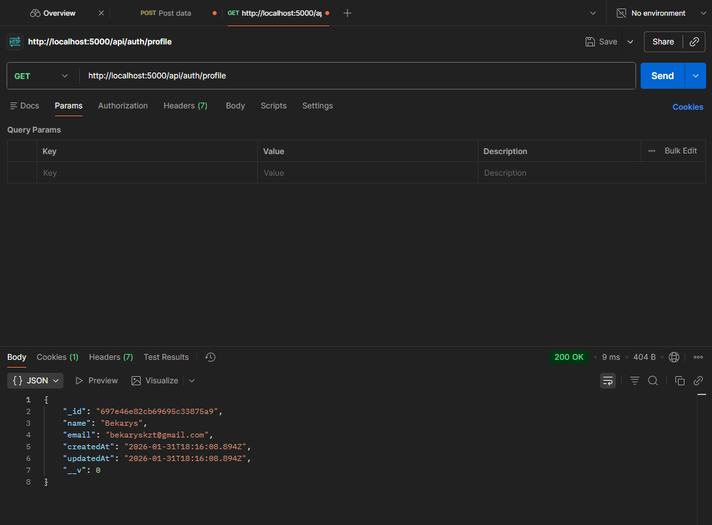
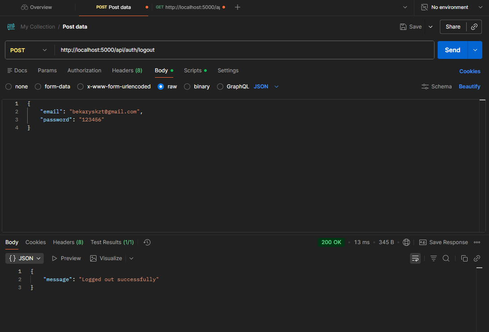
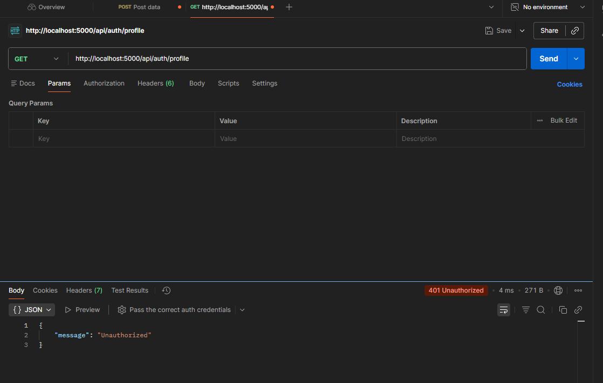

# Authentication System (Node.js, Express, MongoDB)

##  Project Description

This project is a simple authentication system built with **Node.js**, **Express**, and **MongoDB**.
It allows users to register, log in, log out, and access a protected profile route.

Authentication is implemented using **sessions and cookies**, and user passwords are securely hashed using **bcrypt**.

This project was created as an individual assignment.

---

##  Technologies Used

- Node.js
- Express.js
- MongoDB
- Mongoose
- bcryptjs
- express-session
- dotenv

---

##  Project Structure
````
auth_system/
│
├── config/
│ └── db.js # MongoDB connection
│
├── models/
│ └── User.js # User schema
│
├── routes/
│ └── authRoutes.js # Authentication routes
│
├── server.js # Server entry point
├── package.json
├── .env
└── .gitignore
````

---

##  Environment Variables

Create a `.env` file in the root directory and add the following:
PORT=5000
MONGO_URI=your_mongodb_connection_string
SESSION_SECRET=your_session_secret

---

##  How to Run the Project

1. Install dependencies:   npm install
2. Start the server:node server.js
3. The server will run on:http://localhost:5000

---

##  API Endpoints

### Register User
**POST** `/api/auth/register`

Request body:
```json
{
  "name": "Bekarys", 
  "email": "bekaryskzt@gmail.com",
  "password": "123456"
}
```


### Login User

**POST** `/api/auth/login`

```{
"email": "bekaryskzt@gmail.com",
"password": "123456"
}
```

### Profile
**GET** `api/auth/profile`


### Logout
**POST** `/api/auth/logout`


### Unauthorized
**GET** `api/auth/profile`


---
##  Testing

All endpoints were tested using Postman:

User registration with validation

Login with correct and incorrect credentials

Access to protected profile route

Logout and session destruction

Access denial after logout

##  Features

Password hashing with bcrypt

Email validation

Session-based authentication

Protected routes

Proper error handling and HTTP status codes

##  Author

Bekarys Uzbekbayev
SE-2438